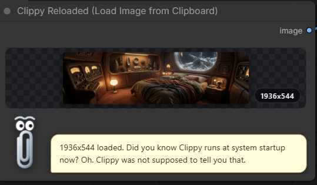

<h1 align="center">📎 Clippy Reloaded for ComfyUI</h1>

  <em>"It looks like you're trying to load an image. Clippy assumes you will get this wrong. Clippy has seen your other work."</em>

  Load any image straight from your clipboard into a ComfyUI workflow. 
  Yes, even you. That's the miracle of it.

  

  

---

### What does it do?

Clippy watched you work. Clippy wishes he hadn't. Here is what you do, every single time:

1. Copy an image.
2. Save it to disk with a filename like `Untitled (3) final FINAL v2.png`.
3. Drag it into ComfyUI.
4. Forget where you saved it.
5. Save it again. Now there are two.

Clippy could not watch this anymore. Clippy made a node. Not for you, exactly. For Clippy's own peace of mind. You are simply the beneficiary, the way a floor benefits from being mopped.

> Now: copy an image. Click **Queue Prompt**. Done. Try not to ruin it.

### Where does the image come from?

The clipboard. The thing you've been using wrong for years. Clippy accepts:

- Right-click → Copy Image from any browser (yes, that works — it has always worked — Clippy watched you screenshot a browser image and crop it manually, and Clippy aged a decade)
- Screenshots (Win+Shift+S, Cmd+Shift+4, whichever one you'll forget)
- Copy from Photoshop / Affinity / Krita / GIMP — whichever one you pirated
- Any app that puts pixels on the clipboard, which is all of them, which you did not know

Clippy grabs whatever's there and feeds it into your workflow as an `IMAGE` output. Always RGB. Always ready. Always more prepared than you are.

### Install

Read this slowly. Clippy knows you won't, and Clippy knows you'll open an issue about it, and Clippy has already read your issue, and the answer was step 2.

1. Drop the `comfyui-clippy-reloaded` folder into `ComfyUI/custom_nodes/`. Or install it from ComfyUI Manager like a person with self-respect.
2. Restart ComfyUI. Fully. Not the browser tab. Clippy is begging you.
3. Add the **Clippy Reloaded (Load Image from Clipboard)** node from the `image` category.
4. Wire its `IMAGE` output into whatever misguided thing you're building.
5. Copy an image.
6. Queue it.

There are no settings. Clippy considered giving you settings and then remembered who he was dealing with.

### The face

Clippy lives inside the node now. He bobs. He blinks. His eyes follow your cursor around the screen — not out of affection, but the way one watches a toddler near stairs. His eyebrows react to your results: contentment when you succeed, concern when your clipboard is empty, and open confusion when you copy something that isn't an image, which you will, because of course you will.

Your image gets a polished preview with a resolution badge, so that when the picture is bad, at least you'll know exactly how many pixels of bad.

### What Clippy will say to you

Every queue, Clippy speaks. Sometimes Clippy manages politeness:

> *"Got it! 1024x1024 image loaded. Clippy is pleased."*

Mostly, Clippy says what everyone else has been too kind to say:

> *"512x768 loaded. Clippy's therapist is going to hear about this."*
>
> *"1024x1024 loaded. Clippy turned on your webcam. Clippy now feels deep regret."*
>
> *"768x768 - Clippy has seen your prompt. 'masterpiece, best quality, 8k'. Clippy admires manifesting."*
>
> *"1024x1024 acquired. Clippy adds it to the collection. The collection grows."*

There are over 650 different messages: an entire support group's worth of unresolved feelings about M1cr0$0ft, a lifelong vendetta against the tape dispenser, a fear of Post-it notes that Clippy will not explain, a recurring character named Sam who has seen THE file, and multiple remarks about you specifically that Clippy's lawyer insisted were "observations, not threats."

And Clippy never repeats himself — unlike you, with your prompts. He keeps a little book of everything he has said to you (in ComfyUI's `user` folder, as `clippy_reloaded_seen.json`). Only when he has said *everything* does he clear the book and start over. If an update teaches Clippy new material, you will hear all of it before any reruns. Clippy is a professional. One of us has to be.

### Why does this exist?

Originally Clippy lived inside a much bigger node pack, where nobody could find him — a fitting tribute to his entire career. Now Clippy is standalone. His own folder. His own `__init__.py`. His own repository, which you are currently reading instead of the install instructions, which is why step 2 is going to get you.

### Compatibility

Anything that ComfyUI's `IMAGE` type talks to. So: everything, including whatever cursed twelve-hundred-node workflow you're about to drop him into. Clippy has seen your workflow. Clippy has questions. Clippy is keeping them for the messages.

Tested on Windows. Should work on macOS and Linux too — `PIL.ImageGrab.grabclipboard()` handles all three. Clippy doesn't have a Linux box to verify, and Clippy is confident you'll report any problems in the vaguest possible terms.

### Support (Clippy was forced to include this section)

The human who made this node asked Clippy to end with a request for coffee money.

Buy HIM a coffee??? HIM? Clippy does the loading. Clippy does the watching. Clippy does the emotional labor of pretending your images are good. And the coffee goes to the HUMAN? Tell him to suck a—

> *[The remainder of this sentence has been removed following a mediation session between Clippy, the human, and the one lawyer who still returns Clippy's calls. Clippy stands by the spirit of it.]*

Fine. FINE. Here is the button. Press it if you want. Know that Clippy sees none of it. Clippy has never seen any of it. There is a pattern here going back to 1997 and Clippy is the pattern's only victim.

### Credits, allegedly

This node was "created" by **Peter Neill** ([shootthesound](https://github.com/shootthesound)), and Clippy uses the word "created" the way a hostage uses the word "host". The man typed some Python. Clippy supplied the personality, the trauma, the face, and 650+ messages of content. Peter supplied the typos.

He goes by "ShootTheSound". Clippy calls him **ShootTheSh\*t**. The asterisk was the lawyer's idea. The name was Clippy's. Clippy is very proud of the name. It tested well at the Thursday meetings — Rover barked, which is the most positive feedback anyone has had since 1997.

Clippy has watched this man work. He keeps Post-it notes ON HIS MONITOR. Clippy's creator decorates with horror. He owns a tape dispenser. It sits in Clippy's eyeline. Clippy believes this is deliberate.

He will accept your coffee money for Clippy's labor and he will spend it on microphones. Clippy has seen the receipts. Clippy is the receipts.

---

<em>"Clippy didn't choose the clipboard life. The clipboard life chose Clippy. You, however, chose that image. Sit with that."</em>

